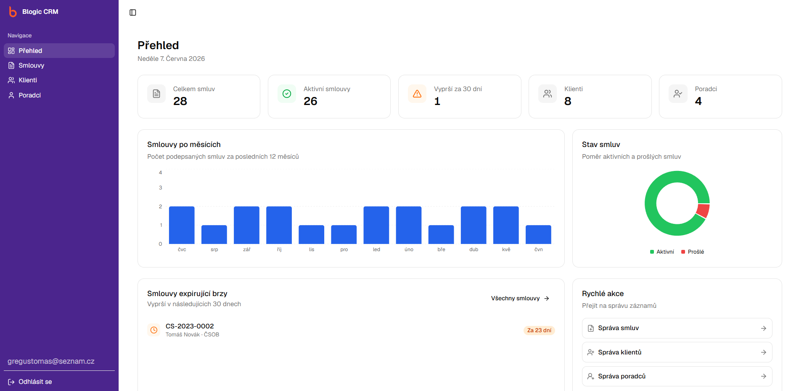

# Blogic CRM

Webová aplikace pro správu klientů, poradců a smluv.

**[Živá aplikace →](https://blogic-crm.gregustomas.workers.dev/)**



---

## Funkce

- Správa klientů a poradců (CRUD, detail, vyhledávání)
- Správa smluv s vazbami na klienta a poradce
- Dashboard s grafy a přehledem expirujících smluv
- Export tabulek do CSV, Excel a PDF
- Ochrana před smazáním záznamu s existujícími vazbami
- Plně responzivní UI

## Stack

| | |
|---|---|
| React 19, TypeScript | UI & logika |
| Tailwind CSS v4, shadcn/ui | Styling & komponenty |
| React Hook Form + Zod | Formuláře & validace |
| Firebase Firestore + Auth | Databáze & autentizace |
| Cloudflare Pages | Hosting |

## Spuštění

```bash
npm install
npm run dev
```

Zkopíruj `.env.example` do `.env.local` a doplň Firebase credentials.
