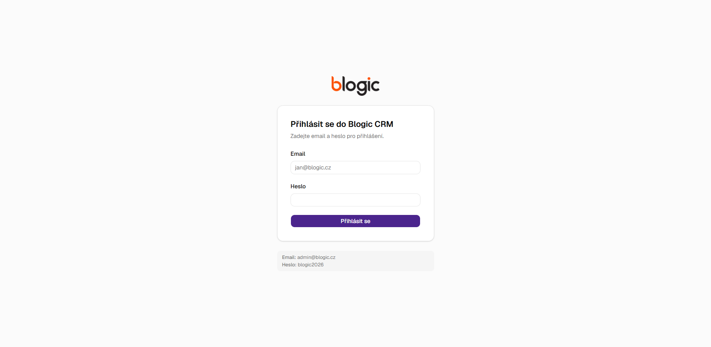
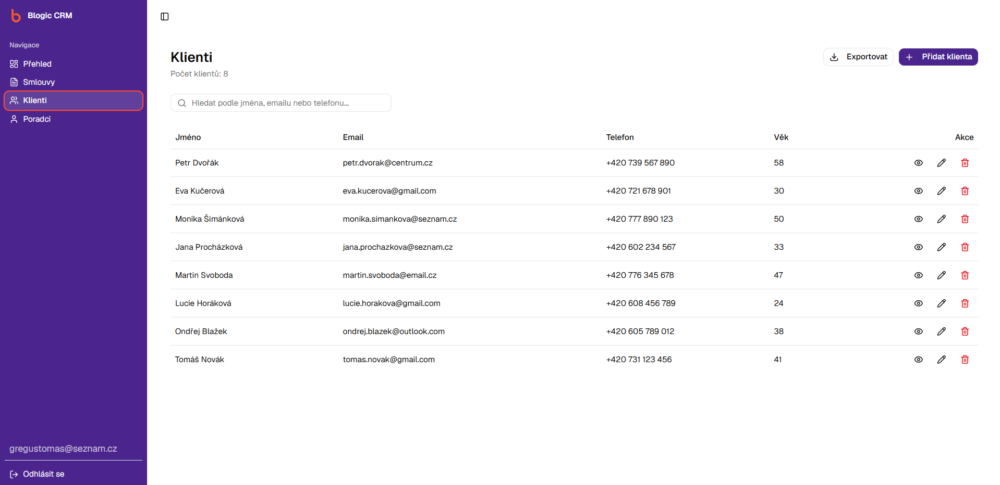
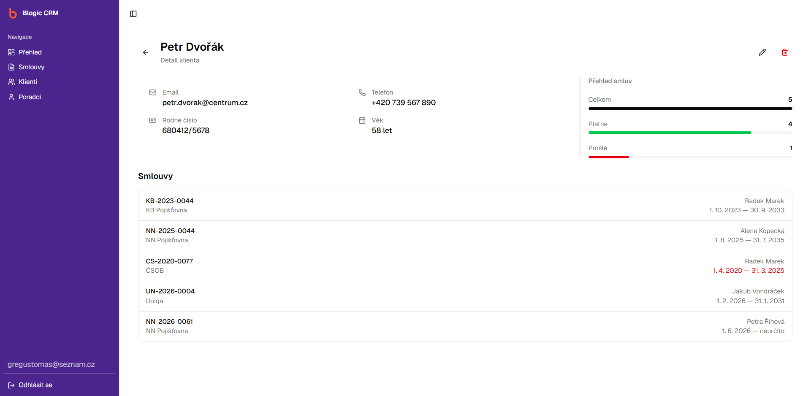
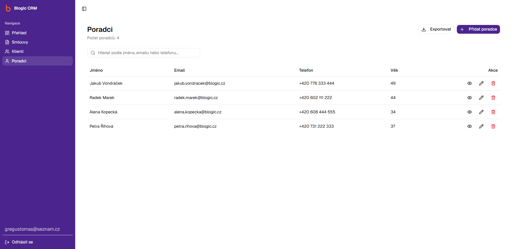
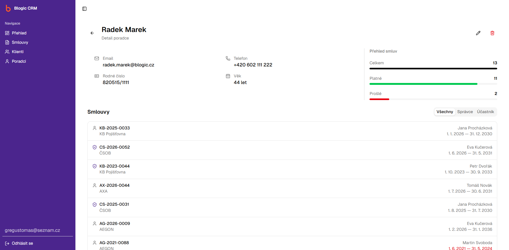
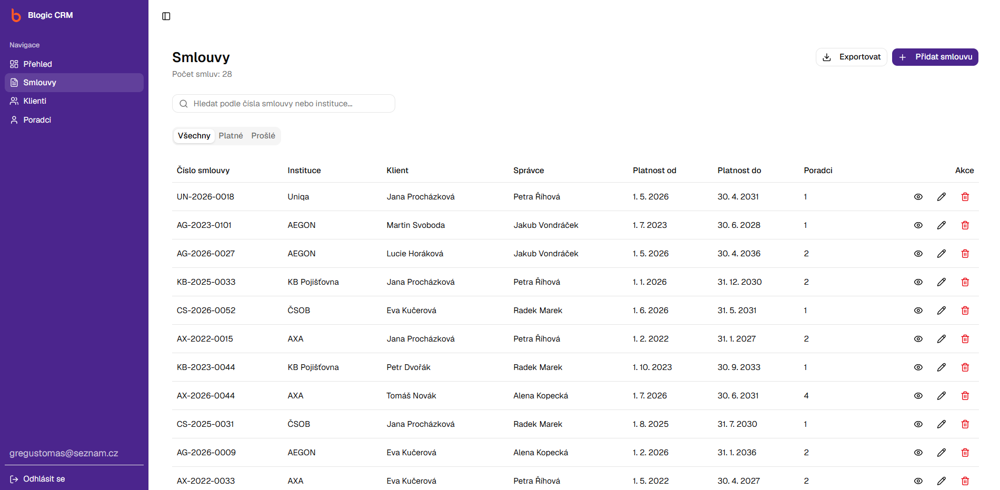
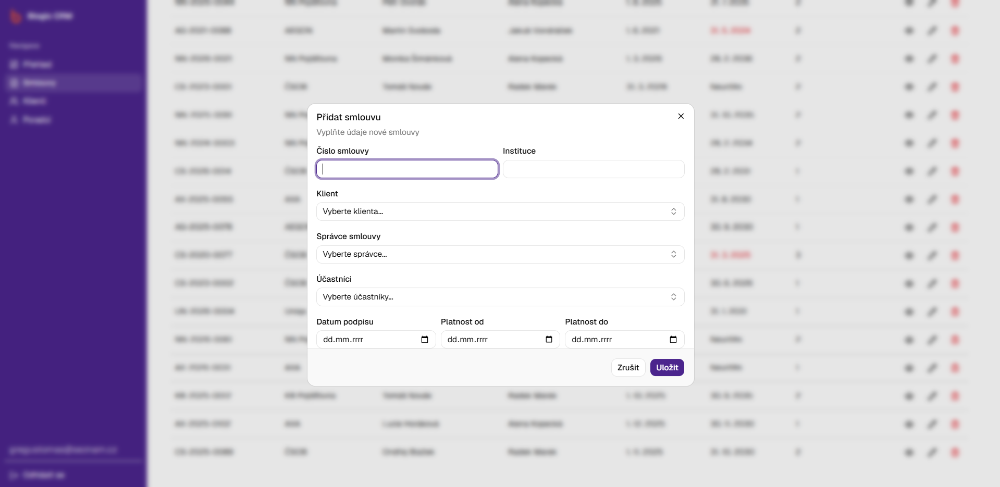
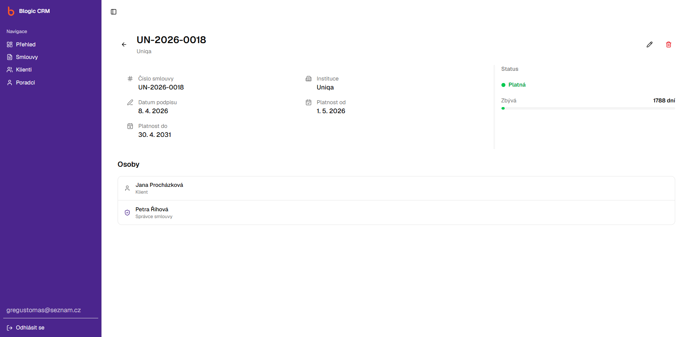

# Technická dokumentace — Blogic CRM

Živá aplikace: https://blogic-crm.gregustomas.workers.dev/

---

## O projektu

Blogic CRM je webová aplikace pro správu klientů, poradců a smluv. Jde o single-page application postavenou na Reactu s Firebase jako backendem. Celá aplikace běží na straně klienta, server pouze servíruje statické soubory a veškerá logika i komunikace s databází probíhá v prohlížeči.

---

## Technologický stack

| Oblast | Technologie |
|---|---|
| UI framework | React 19 |
| Jazyk | TypeScript |
| Bundler | Vite 8 |
| Styling | Tailwind CSS v4 |
| Komponenty | shadcn/ui |
| Formuláře | React Hook Form + Zod |
| Routing | React Router v7 |
| Databáze | Firebase Firestore |
| Autentizace | Firebase Auth |
| Grafy | Recharts |
| Export | jsPDF, jspdf-autotable, xlsx |
| Hosting | Cloudflare Pages |

---

## Architektura

Aplikace je čistá SPA. Uživatel se přihlásí přes Firebase Auth, po přihlášení aplikace načítá a zapisuje data přímo do Firestore pomocí real-time listenerů. Cloudflare Pages hostuje výstup buildu (`dist/`).

```
Prohlížeč (React SPA)
    |
    +-- Firebase Auth (přihlášení)
    |
    +-- Firebase Firestore (data v reálném čase)

Cloudflare Pages (statický hosting)
```

---

## Datový model

Firestore obsahuje tři kolekce. Věk se v databázi neukládá, počítá se dynamicky z rodného čísla funkcí `getAgeFromPersonalId()` při každém zobrazení.

### Klient (`clients`)

```ts
{
  id: string
  firstName: string
  lastName: string
  email: string        // unikátní v rámci kolekce
  phone: string
  personalId: string   // rodné číslo, formát XXXXXX/XXXX, unikátní
}
```

### Poradce (`advisors`)

```ts
{
  id: string
  firstName: string
  lastName: string
  email: string        // unikátní
  phone: string
  personalId: string   // unikátní
}
```

### Smlouva (`contracts`)

```ts
{
  id: string
  registrationNumber: string  // evidenční číslo, unikátní
  institution: string
  clientId: string            // reference na dokument v clients
  managerId: string           // reference na dokument v advisors
  participantIds: string[]    // pole referencí na advisors
  signedAt: string            // ISO datum (YYYY-MM-DD)
  validFrom: string           // ISO datum
  validUntil: string | null   // null = bez stanoveného konce platnosti
}
```

---

## Struktura projektu

```
src/
├── assets/              # loga
├── components/
│   ├── contract/        # ContractsForm, ContractsTable ...
│   ├── dashboard/       # StatCard, ContractsBarChart, ContractsPieChart,
│   │                    # ExpiringSoonList, QuickActions
│   ├── layout/          # Layout.tsx — sidebar wrapper + Outlet
│   ├── ui/              # shadcn/ui komponenty (Button, Dialog, Table, ...)
│   └── user/            # UserForm, UserTable, UserInfoGrid
├── hooks/               # useClients, useAdvisors, useContracts (onSnapshot)
├── lib/
│   ├── firebase.ts      # inicializace Firebase SDK
│   ├── schemas.ts       # Zod schémata pro formuláře
│   ├── export.ts        # exportní funkce CSV, Excel, PDF
│   └── utils.ts         # getAgeFromPersonalId, formatPersonalId, fullName, ...
├── pages/               # LoginPage, Dashboard, ClientsPage, AdvisorsPage,
│   │                    # ContractsPage, ClientDetailPage, AdvisorDetailPage,
│   │                    # ContractDetailPage, NotFoundPage
└── services/            # CRUD operace nad Firestore
    ├── clients.ts
    ├── advisors.ts
    └── contracts.ts
```

---

## Klíčové implementační detaily

### Autentizace a ochrana tras

`Layout.tsx` sleduje stav přihlášení přes `onAuthStateChanged`. Nepřihlášený uživatel je okamžitě přesměrován na `/login`. Firestore Security Rules omezují přístup k datům pouze pro ověřené uživatele.

### Real-time data

Hooky `useClients`, `useAdvisors` a `useContracts` používají Firestore `onSnapshot`, takže tabulky a grafy se aktualizují v reálném čase bez nutnosti obnovovat stránku.

### Výpočet věku

Věk se nepersistuje do databáze. Funkce `getAgeFromPersonalId(personalId)` v `utils.ts` parsuje rodné číslo (řeší specifika pro ženy s měsícem +50, ročníky po roce 2004 s +20 nebo +70) a vrací aktuální věk při každém zobrazení.

### Validace formulářů

`userSchema` (Zod) ověřuje formát rodného čísla a věk 18 až 100 let. `contractSchema` kontroluje logiku dat: datum podpisu musí být před nebo shodné s datem začátku platnosti a datum konce platnosti nesmí být dřívější než začátek.

### Ochrana před smazáním

Klient s existujícími smlouvami nemůže být smazán. Poradce, který je správcem smlouvy, také nemůže být smazán. Pokud je poradce pouze účastníkem (ne správcem), je při smazání z příslušných smluv automaticky odebrán.

### Export

Podporované formáty jsou CSV, Excel (.xlsx) a PDF. Exportují se vždy aktuálně filtrovaná data, tedy to, co uživatel vidí v tabulce po případném vyhledávání nebo filtrování záložkou.

### Responzivita

Aplikace je plně responzivní. Na mobilních zařízeních se postranní panel zobrazuje jako překryvná vrstva (Radix Sheet), která se automaticky zavírá při navigaci. Tabulky mají horizontální scroll uvnitř svého kontejneru. Hlavičky stránek s akčními tlačítky se na malých obrazovkách skládají pod sebe.

---

## Screenshoty

### Přihlášení



### Dashboard


### Klienti



### Detail klienta



### Poradci



### Detail poradce



### Smlouvy



### Formulář smlouvy



### Detail smlouvy



---

## Nasazení

### Lokální spuštění

```bash
npm install
npm run dev
```

### Produkční build

```bash
npm run build
```

TypeScript kompilátor (`tsc -b`) proběhne před Vite buildem. Build selže při jakékoliv chybě typů.

### Cloudflare Pages

Build command: `npm run build`

Output directory: `dist`

Environment variables se nastaví v Cloudflare Pages pod Settings > Environment variables.

### Potřebné proměnné prostředí

```
VITE_FIREBASE_API_KEY
VITE_FIREBASE_AUTH_DOMAIN
VITE_FIREBASE_PROJECT_ID
VITE_FIREBASE_STORAGE_BUCKET
VITE_FIREBASE_MESSAGING_SENDER_ID
VITE_FIREBASE_APP_ID
```

---

## Možná vylepšení

| Oblast | Popis |
|---|---|
| Testování | Unit testy utils/schémat (Vitest). |
| Role a oprávnění | Přidat role `admin` / `readonly` přes Firebase Auth custom claims a Firestore Security Rules. |
| E-mailové notifikace | Cloud Functions + Cloud Scheduler pro denní e-mail s přehledem smluv blížících se expiraci. |
| Auditní log | Kolekce `audit_log` plněná Cloud Functions pro historii změn (kdo, kdy, co). |
| Offline podpora | Povolit Firestore IndexedDB persistenci + Vite PWA plugin pro funkčnost bez sítě. |
